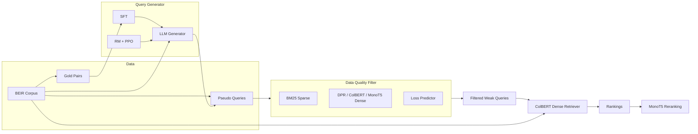

# iGFT

### From Missteps to Mastery: Enhancing Low-Resource Dense Retrieval through Adaptive Query Generation

Official implementation of adaptive pseudo-query generation for low-resource dense retrieval, published at **KDD '25**.

[](https://doi.org/10.1145/3690624.3709225)
[](LICENSE)
[](pyproject.toml)
[](third_party/README.md)
[](third_party/README.md)

---

## Table of Contents

- [Highlights](#highlights)
- [How It Works](#how-it-works)
- [Repository Layout](#repository-layout)
- [Installation](#installation)
- [Quick Start](#quick-start)
  - [1 · Data Preparation](#1--data-preparation)
  - [2 · Low-Resource Query Generation](#2--low-resource-query-generation)
  - [3 · Multi-Stage Data Filtering](#3--multi-stage-data-filtering)
  - [4 · Reward Model &amp; PPO](#4--reward-model--ppo)
  - [5 · ColBERT Training &amp; Validation](#5--colbert-training--validation)
  - [6 · Post-Retrieval Reranking](#6--post-retrieval-reranking)
- [Other Settings](#other-settings)
  - [Zero-Shot Setting](#zero-shot-setting)
  - [Fully-Supervised Setting](#fully-supervised-setting)
- [Acknowledgments](#acknowledgments)
- [Citation](#citation)
- [License](#license)

## Highlights

- **Low-resource by design** — bootstrap a query generator with as few as 50 gold pairs.
- **Adaptive pseudo-query generation** — supervised fine-tuning followed by reward-model-guided PPO.
- **Multi-view quality filtering** — sparse (BM25), dense (DPR / ColBERT / MonoT5) and active-learning (loss prediction) signals jointly score synthetic queries.
- **End-to-end dense retrieval** — filtered pseudo queries train a ColBERT retriever whose output can be refined with MonoT5 reranking.
- **Three settings in one repo** — low-resource, zero-shot and fully-supervised pipelines.

## How It Works



## Repository Layout

```
iGFT/
├── igft/                        # iGFT package (data + filtering + reranking)
│   ├── data/                    #   data sampling / conversion utilities
│   └── filtering/               #   sparse & dense filters, loss predictor, MonoT5
├── configs/
│   └── llamafactory/            # SFT / generation / RM / PPO YAML configs
├── scripts/                     # unified shell entry points for every stage
├── third_party/                 # vendored frameworks (kept fully separate)
│   ├── LLaMA-Factory/           #   LLM fine-tuning & RL backbone
│   └── SPTAR/                   #   BEIR data prep + ColBERT/DPR retrieval
├── pyproject.toml               # installs the `igft` package + CLI entry points
├── requirements.txt             # curated runtime dependencies
├── requirements-lock.txt        # original fully-pinned environment snapshot
└── LICENSE                      # MIT
```

> The vendored frameworks are **not** merged into the `igft` package: LLaMA-Factory
> and SPTAR each own their CLI, entry points and Python/CUDA environments. Keeping
> them separate is required for exact reproducibility and clean licensing. See
> [`third_party/README.md`](third_party/README.md) for origins and installation notes.

## Installation

### 1. iGFT package (query generation + filtering)

Install PyTorch first with the wheel matching your CUDA version, then install the repo:

```bash
pip install torch --index-url https://download.pytorch.org/whl/cu126
pip install -e .            # installs igft and its console scripts
pip install -e third_party/LLaMA-Factory   # provides llamafactory-cli
```

### 2. SPTAR / ColBERT retrieval environments

The retrieval stage reuses the original SPTAR Python 3.7 environment and the ColBERT
`col37bert` environment:

```bash
cd third_party/SPTAR
conda env create -f dense_retrieval/environment.yml                       # py37
conda env create -f dense_retrieval/retriever/col_bert/col37bert.yml      # col37bert
cd ../..
```

Follow the inline notes in `third_party/SPTAR/dense_retrieval/packages/README.md`
for the small `beir` / `sentence-transformers` patches used by DPR training.

## Quick Start

### 1 · Data Preparation

Download a BEIR dataset and build the reduced corpora used by retrieval training:

```bash
bash scripts/download_beir.sh fiqa
bash scripts/prepare_sptar_corpus.sh fiqa 100k
```

`prepare_sptar_corpus.sh` follows SPTAR's data-preparation convention: it keeps the
documents that appear in the gold/pseudo training qrels and samples negatives at a
fixed ratio. Datasets that were pseudo-query processed before may already contain
the `corpus_filtered_*_id.tsv` files it expects under
`third_party/SPTAR/pseudo_query/data/`.

Sample a low-resource training set (50 pairs here). The default output lands at
`third_party/LLaMA-Factory/data/fiqa_train.json`, and the same pairs are written as
the `prompt_tuning_50.tsv` qrels file expected by the SPTAR retrieval stage. Use
`--shuffle` to randomly sample instead of taking the first rows:

```bash
python -m igft.data.sample_init_data --dataset fiqa --num 50
```

If you use another dataset, append an entry to `third_party/LLaMA-Factory/data/dataset_info.json`:

```json
"<dataset>_train": {
  "file_name": "<dataset>_train.json",
  "columns": {
    "prompt": "instruction",
    "query": "input",
    "response": "output"
  }
}
```

### 2 · Low-Resource Query Generation

Supervised fine-tune the query generator:

```bash
bash scripts/sft.sh 0
```

Generate pseudo queries with the tuned adapter (point `adapter_name_or_path` inside
[`configs/llamafactory/generation.yaml`](configs/llamafactory/generation.yaml) at your
checkpoint):

```bash
bash scripts/generate.sh 0
```

### 3 · Multi-Stage Data Filtering

Generated queries cannot be trusted out of the box. iGFT scores them from several
complementary perspectives before they can enter retriever training.

**Sparse retrieval signal (BM25):** the target document is mixed into a pool of
random candidate documents; a pseudo query keeps its score only when BM25 ranks the
target first.

```bash
python -m igft.filtering.filter \
  --pseudo <pseudo_query.json> \
  --corpus third_party/SPTAR/dense_retrieval/datasets/raw/beir/fiqa/corpus.jsonl \
  --mode BM25 \
  --candidate-num 500 \
  --output outputs/fiqa_bm25.json
```

**Dense semantic signal (DPR / ColBERT / MonoT5):** swap `--mode` for a different
backbone. `--candidate-num` controls the size of the random distractor pool.

```bash
python -m igft.filtering.filter \
  --pseudo <pseudo_query.json> \
  --corpus third_party/SPTAR/dense_retrieval/datasets/raw/beir/fiqa/corpus.jsonl \
  --mode DPR \
  --candidate-num 500 \
  --output outputs/fiqa_dpr.json
```

**Active-learning loss prediction:** train a loss predictor on the current weak
queries, then use it to predict how much each pseudo query would improve retriever
training.

```bash
# train
python -m igft.filtering.al \
  --mode train \
  --pseudo <pseudo_query.json> \
  --corpus third_party/SPTAR/dense_retrieval/datasets/raw/beir/fiqa/corpus.jsonl

# predict
python -m igft.filtering.al \
  --pseudo <pseudo_query.json> \
  --corpus third_party/SPTAR/dense_retrieval/datasets/raw/beir/fiqa/corpus.jsonl \
  --output outputs/fiqa_al.json
```

### 4 · Reward Model & PPO

The filtered results are used to build a preference dataset (`ranking: true` in
`dataset_info.json`, each record containing a chosen and a rejected pseudo query).
Train a reward model and then run PPO:

```bash
bash scripts/train_reward_model.sh 0
bash scripts/ppo.sh 0
```

Repeat **generation → filtering → RM/PPO** as many iterations as needed; the PPO
output (`saves/ppo`) becomes the next generator checkpoint.

### 5 · ColBERT Training & Validation

First convert the filtered pseudo queries into the weak-training files consumed by
the SPTAR loader:

```bash
bash scripts/prepare_colbert_data.sh fiqa outputs/fiqa_filtered.json my_run
```

Generate the ColBERT collections / triples, train the retriever and evaluate it:

```bash
bash scripts/gen_colbert_training_data.sh fiqa my_run 100k
bash scripts/train_colbert.sh -g 0 -d fiqa -e my_run -m 500 -s 500 -b 64
bash scripts/test_colbert.sh -g 0 -d fiqa -e my_run -p 60 -c 500
```

`train_colbert.sh` and `test_colbert.sh` accept the same flags as the original
SPTAR scripts (`-g` GPUs, `-d` dataset, `-e` experiment, `-m` max steps, `-s` save
frequency, `-b` batch size, `-p` partitions, `-c` checkpoint step).

### 6 · Post-Retrieval Reranking

Refine the retrieved candidate lists with MonoT5:

```bash
python -m igft.filtering.reranker \
  --corpus third_party/SPTAR/dense_retrieval/datasets/raw/beir/fiqa/corpus.jsonl \
  --query third_party/SPTAR/dense_retrieval/datasets/raw/beir/fiqa/queries.jsonl \
  --ranking <retrieval_ranking.tsv>
```

## Other Settings

### Zero-Shot Setting

Without any gold data for supervised fine-tuning, skip SFT and sample pseudo
queries directly from the base model with a zero-shot prompt:

```bash
bash scripts/generate_zero_shot.sh 0
```

The remaining filtering → retrieval → reranking steps are identical to the
low-resource setting.

### Fully-Supervised Setting

Use the entire original training split instead of a small sample:

```bash
python -m igft.data.sample_init_data --dataset fiqa --num -1
```

## Acknowledgments

The LLM fine-tuning / reinforcement-learning backbone is built on
[LLaMA-Factory](https://github.com/hiyouga/LLaMA-Factory), and the dense retrieval
part follows [SPTAR](https://github.com/zhiyuanpeng/SPTAR) and
[ColBERT](https://github.com/stanford-futuredata/ColBERT). Thanks to their authors
for the excellent open-source work.

## Citation

If you find this repository useful for your research, please cite:

```bibtex
@inproceedings{tongigft,
author = {Tong, Zhenyu and Qin, Chuan and Fang, Chuyu and Yao, Kaichun and Chen, Xi and Zhang, Jingshuai and Zhu, Chen and Zhu, Hengshu},
title = {From Missteps to Mastery: Enhancing Low-Resource Dense Retrieval through Adaptive Query Generation},
year = {2025},
isbn = {9798400712456},
publisher = {Association for Computing Machinery},
address = {New York, NY, USA},
url = {https://doi.org/10.1145/3690624.3709225},
doi = {10.1145/3690624.3709225},
booktitle = {Proceedings of the 31st ACM SIGKDD Conference on Knowledge Discovery and Data Mining V.1},
pages = {1373–1384},
numpages = {12},
keywords = {dense retrieval, large language model, query generation},
location = {Toronto ON, Canada},
series = {KDD '25}
}
```

## License

The iGFT code is released under the [MIT License](LICENSE). The vendored frameworks
under [`third_party/`](third_party/README.md) remain under their respective licenses.
